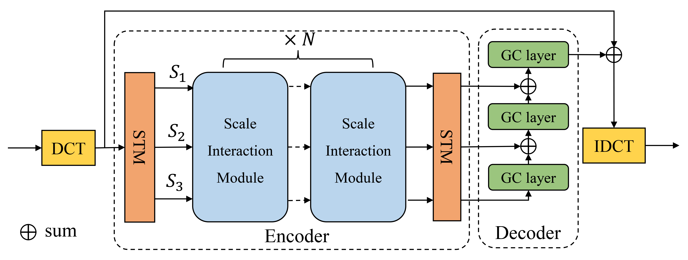
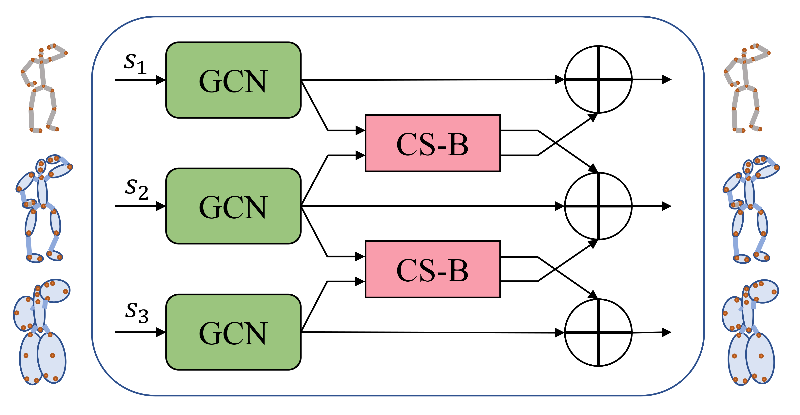
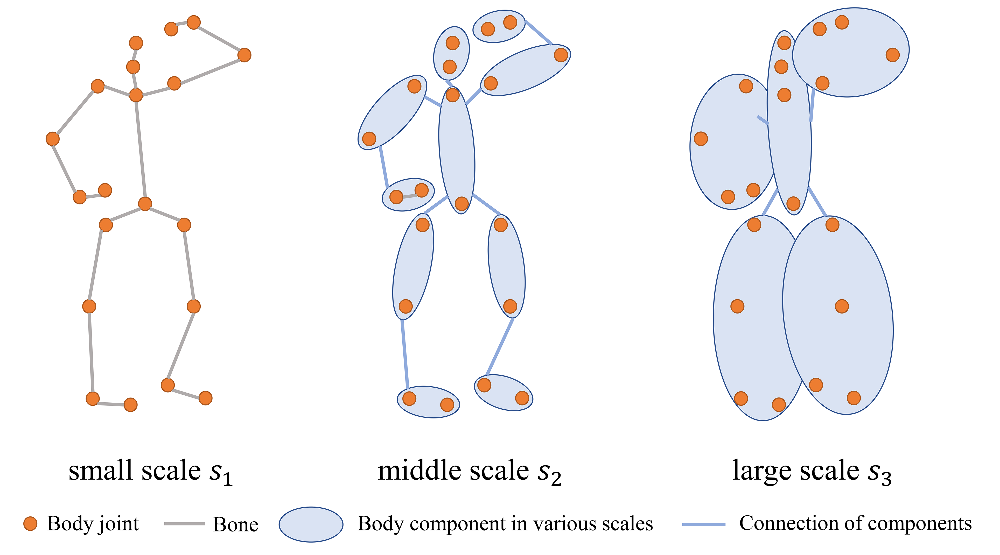
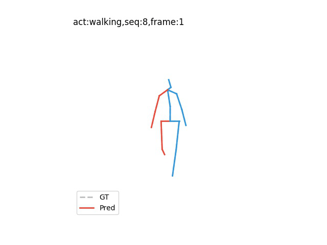
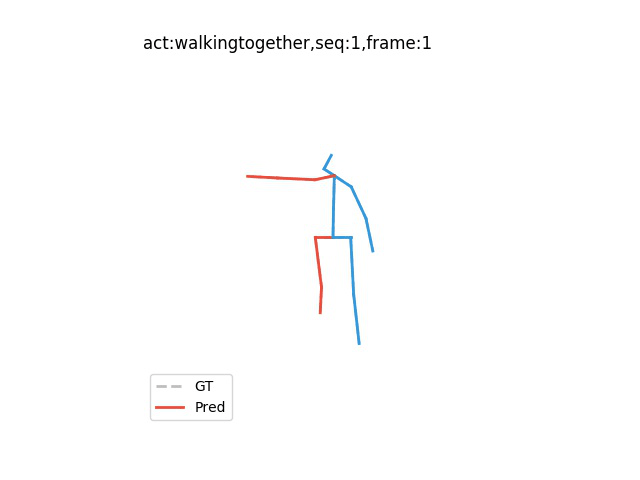

# MGCN
Multi-scale GCN model for Human motion prediction.
## Model Diagrams
- Framework:
  

- Multi-scale interaction coding module:

- 

$$ 
X_{s_{2}} = A_{{s_{1}s_{2}}}X{s_{1}}+X_{s_{2}}
$$

- Definition for Multi-scale:

## Train
After training, the MAE and MPJPE at each epoch on test set as well as the model checkpoints will be restored in the 'checkpoint' folder.
### Train on H36M for short-term prediction 
```bash
python main.py --input_n 10 --output_n 10 --dct_n 20 --exp train_h36m_short --data_format h36m --data_dir [YOUR DATASET PATH]
```
when training on the 3d data，run：
```bash
python main_3d.py --input_n 10 --output_n 10 --dct_n 20 --exp train_h36m_short_3d --data_format h36m_3d --data_dir [YOUR DATASET PATH]
```
### Train on H36M for long-term prediction
```bash
python main.py --input_n 10 --output_n 25 --dct_n 35 --exp train_h36m_long --data_format h36m --data_dir [YOUR DATASET PATH]
```
when training on the 3d data，run：
```bash
python main_3d.py --input_n 10 --output_n 25 --dct_n 35 --exp train_h36m_long_3d --data_format h36m_3d --data_dir [YOUR DATASET PATH]
```
### Train on CMU-mocap dataset for short term prediction
```bash
python main_cmu.py --input_n 10 --output_n 10 --dct_n 20 --exp train_cmu_short --data_format cmu --data_dir_cmu [YOUR DATASET PATH]
```
when training on the 3d data，run：
```bash
python main_cmu_3d.py --input_n 10 --output_n 10 --dct_n 20 --exp train_cmu_short_3d --data_format cmu_3d --data_dir_cmu [YOUR DATASET PATH]
```
### Train on CMu-mocap daaset for long term prediction
```bash
python main_cmu.py --input_n 10 --output_n 25 --dct_n 35 --exp train_cmu_long --data_format cmu --data_dir_cmu [YOUR DATASET PATH]
```
when training on the 3d data，run：
```bash
python main_cmu_3d.py --input_n 10 --output_n 25 --dct_n 35 --exp train_cmu_long_3d --data_format cmu_3d --data_dir_cmu [YOUR DATASET PATH]
```

## Visualizaton
 The files `viz_h36m.py`, `viz_h36m_3d.py`, `viz_cmu.py`, `viz_cmu_3d.py` are used to visualize the prediction and ground truth.
### visualize results with model trained for h36m short-term angle data
firstly change the model and the img and gif path in `viz_h36m.py` at:
```python
if __name__ == "__main__":
    option = Options().parse()
    main(option,
         img_path="/mnt/DataDrive164/zhouhonghong/outputs/MGCN/h36m_long/imgs",
         model_path_short='checkpoint/h36m_short/ckpt_main_in10_out10_dctn20_best.pth.tar',
         model_path_long='checkpoint/h36m_long/ckpt_main_in10_out25_dctn35_best.pth.tar')
    save_gif(imgs_root="/mnt/DataDrive164/zhouhonghong/outputs/MGCN/h36m_long/imgs",
             gif_root="/mnt/DataDrive164/zhouhonghong/outputs/MGCN/h36m_long/gifs",)
```
and then run:
```bash
python viz_h36m.py --input_n 10 --output_n 10 --dct_n 20 --data_format h36m --data_dir [YOUR DATASET PATH]
```
 ### visualize results with model trained on other dataset or long term or 3d data
 firstly change the firstly change the model and the img and gif path in the corresponding `viz_XXX.py` at:
 ```python
if __name__ == "__main__":
    option = Options().parse()
    main(option,
         img_path="/mnt/DataDrive164/zhouhonghong/outputs/MGCN/h36m_long/imgs",
         model_path_short='checkpoint/h36m_short/ckpt_main_in10_out10_dctn20_best.pth.tar',
         model_path_long='checkpoint/h36m_long/ckpt_main_in10_out25_dctn35_best.pth.tar')
    save_gif(imgs_root="/mnt/DataDrive164/zhouhonghong/outputs/MGCN/h36m_long/imgs",
             gif_root="/mnt/DataDrive164/zhouhonghong/outputs/MGCN/h36m_long/gifs",)
```
and then run following command with the right `input_n`,`output_n`,`dct_n`, `data_format` and `data_dir`.(just the same as the corresponding training command)
```bash
python viz_h36m.py --input_n X --output_n X --dct_n X --data_format X --data_dir [YOUR DATASET PATH]
```
## visulization results
### trained on H36M 3d data for long-term prediction
- walking



- walking together


